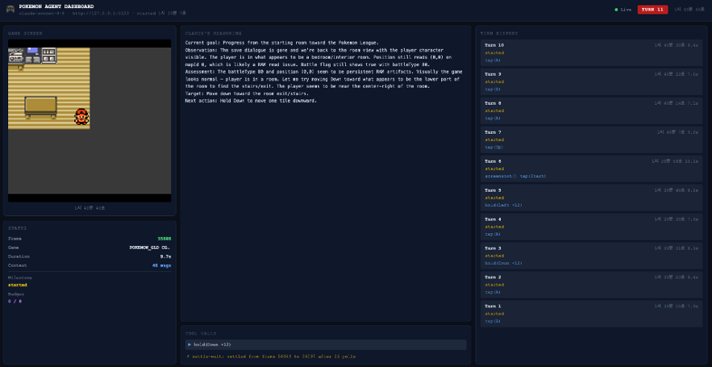

# Pokemon Agent

> Claude AI가 mGBA 에뮬레이터를 직접 조작해 포켓몬 게임을 자율 플레이하는 실험적 AI Agent 응용 프로젝트.



## Goal

  > 해당 프로젝트는 Pokemon - Gold Version (K) ROM 파일을 별도로 구하여 진행합니다.

Phase 1. **자율 클리어 모드**: 사용자 역할을 agent가 대신하여 포켓몬 리그 클리어까지 최대한 빠르게 진행. (in progress)
Phase 2. **방해 NPC 모드**: 사용자가 직접 플레이하고, 게임 내 NPC 역할을 agent가 대신하여 클리어를 방해. (not yet)

---

## Architecture

```
┌─────────────────────────────────────────────────────────┐
│                    Pokemon Agent Stack                  │
│                                                         │
│  ┌──────────┐    Lua Socket    ┌───────────────────┐    │
│  │  mGBA    │◄────────────────►│  mGBA-http bridge │    │
│  │ Emulator │   port 8888      │    port 5123      │    │
│  └──────────┘                  └─────────┬─────────┘    │
│                                          │ HTTP         │
│                                ┌─────────▼─────────┐    │
│                                │  FastAPI Backend  │    │
│                                │    port 8000      │    │
│                                │  Claude AI Agent  │    │
│                                └─────────┬─────────┘    │
│                                          │              │
│                                ┌─────────▼─────────┐    │
│                                │   Dashboard UI    │    │
│                                └───────────────────┘    │
└─────────────────────────────────────────────────────────┘
```

### 컴포넌트

| 컴포넌트 | 역할 | 포트 |
|---|---|---|
| **mGBA** | GBC/GBA 에뮬레이터 — 게임 실행 | — |
| **mGBASocketServer.lua** | mGBA 내부 Lua 스크립트 — 버튼/스크린샷 소켓 노출 | 8888 |
| **mGBA-http** | Lua 소켓을 HTTP REST API로 변환하는 브릿지 | 5123 |
| **FastAPI backend** | Claude AI 게임 루프, REST API, WebSocket, 대시보드 서빙 | 8000 |
| **Dashboard** | 실시간 게임 모니터링 및 에이전트 컨트롤러 UI | (8000/dashboard) |

---

## Prerequisites

- **macOS** (mGBA `.app` 기준)
- **Python 3.11+**
- **Node.js 20+**, **pnpm 11.2.2**
- **mGBA** 에뮬레이터 설치 (`/Applications/mGBA.app`)
- **Anthropic API Key**

---

## Quick Start

### 1. 환경 설정

```bash
cp .env.example .env
# .env에서 ANTHROPIC_API_KEY 설정
```

### 2. 실행

```bash
chmod +x start.sh
./start.sh
```

`start.sh`가 자동으로 수행하는 작업:

1. 이전 프로세스 정리
2. Python venv 생성 및 의존성 설치
3. mGBA 에뮬레이터 실행 (Pokemon Gold ROM)
4. **[수동 단계]** mGBA에서 Lua 스크립트 로드 안내
5. mGBA-http 브릿지 시작 (포트 5123)
6. FastAPI 백엔드 시작 (포트 8000)
7. 브라우저에서 대시보드 자동 오픈

### 3. Lua 스크립트 수동 로드 (필수)

`start.sh` 실행 중 안내 메시지가 나타나면:

```
mGBA → Tools → Scripting
```

스크립팅 콘솔에서 아래 명령 입력:

```lua
dofile("your_save_rom_file_path")
```

로드 완료 후 터미널에서 Enter를 누르면 나머지 서비스가 시작됩니다.

---

## Dashboard

`http://localhost:8000/dashboard/` 에서 확인 가능:

| 패널 | 기능 |
|---|---|
| **Game View** | 실시간 스크린샷, 프레임/배지/마일스톤 현황 |
| **Loop Control** | Agent Start / Pause / Resume / Stop |
| **LLM Inference** | System Prompt / Observation / Response / Action Plan 탭 |
| **Controller** | 모델 선택, Max Tokens, 슈퍼바이저 타이밍, mGBA URL 설정 |
| **Turn History** | 턴별 히스토리, 에러 표시, 클릭으로 과거 턴 리플레이 |

---

## Configuration

### `.env` 주요 설정

```bash
ANTHROPIC_API_KEY=your-api-key-here
MGBA_HTTP_BASE_URL=http://127.0.0.1:5123   # mGBA-http 브릿지 포트
AI_MODEL=claude-opus-4-7                    # 사용할 Claude 모델
MAX_TOKENS=8192

# 슈퍼바이저 타이밍 (프레임 단위)
DIRECTIONAL_HOLD_FRAMES=12   # 방향키 1타일 이동 시간
BUTTON_TAP_FRAMES=6          # A/B/Start/Select 탭 시간
POST_ACTION_SETTLE_FRAMES=48 # 액션 후 안정화 대기
BLACK_FRAME_MAX_POLLS=5      # 검은 화면 폴링 최대 횟수

# 컨텍스트 관리
MIN_TURNS_TO_KEEP=8          # Claude 대화 히스토리 보존 턴 수
```

### 런타임 설정 변경

대시보드 Controller 패널에서 실행 중에도 모델, 시스템 프롬프트, 슈퍼바이저 타이밍을 변경할 수 있습니다. (`PATCH /api/config`)

---

## API

| Endpoint | Method | 설명 |
|---|---|---|
| `/dashboard/` | GET | 대시보드 UI |
| `/api/state` | GET | 현재 게임 루프 상태 전체 |
| `/api/loop/start` | POST | 에이전트 루프 시작 |
| `/api/loop/stop` | POST | 에이전트 루프 중지 |
| `/api/loop/pause` | POST | 일시 정지 |
| `/api/loop/resume` | POST | 재개 |
| `/api/loop/status` | GET | 루프 상태 조회 |
| `/api/config` | GET/PATCH | 설정 조회/변경 |
| `/api/emulator/status` | GET | 에뮬레이터 상태 (프레임, 게임 타이틀) |
| `/api/emulator/screenshot` | GET | 현재 스크린샷 (base64 PNG) |
| `/ws` | WebSocket | 실시간 상태 push |
| `/docs` | GET | FastAPI Swagger UI |

---

## Project Structure

```
pokemon_agent/
├── start.sh                    # 전체 스택 실행 스크립트
├── .env                        # 환경 변수 (git 제외)
├── .env.example                # 환경 변수 템플릿
│
├── backend/                    # Python FastAPI 백엔드
│   ├── main.py                 # FastAPI 앱 진입점
│   ├── requirements.txt
│   └── app/
│       ├── config.py           # 런타임 설정 (pydantic-settings)
│       ├── agent.py            # Claude AI 에이전트 루프
│       ├── game_loop.py        # 게임 루프 관리 (start/stop/pause)
│       ├── emulator.py         # mGBA-http HTTP 클라이언트
│       ├── screenshot.py       # 스크린샷 처리 + 그리드 오버레이
│       ├── observation.py      # RAM 상태 + 스크린샷 통합 관측
│       ├── supervisor.py       # 버튼 입력 슈퍼바이저 (타이밍 강제)
│       ├── stuck_memory.py     # 스턱 감지 메모리
│       ├── loop_detector.py    # 루프/반복 패턴 감지
│       ├── milestones.py       # 포켓몬 리그 마일스톤 추적
│       ├── pokemon_state.py    # 포켓몬 RAM 상태 파싱
│       ├── state_store.py      # WebSocket 브로드캐스트 상태 저장소
│       └── tools.py            # Claude tool 정의 (mgba_tap, mgba_hold 등)
│
├── dashboard/
│   └── index.html              # 단일 파일 대시보드 UI (Tailwind CSS)
│
├── src/                        # TypeScript 레거시 에이전트 (참고용)
│   └── index.ts                # 구 TypeScript 에이전트 진입점
│
└── .local-tools/
    └── mgba-http/
        ├── mGBA-http           # mGBA-http 브릿지 바이너리
        ├── mGBASocketServer.lua # mGBA Lua 소켓 서버 스크립트
        └── appsettings.json    # 브릿지 설정 (포트 5123)
```

---

## Agent Behavior

에이전트는 매 턴마다 다음 프로토콜을 따릅니다:

1. **Observe** — RAM 상태 + 스크린샷 캡처
2. **Detect** — 스턱/루프 패턴 감지 (자동 탈출: B×3)
3. **Plan** — `<action_plan>` 블록으로 현재 목표·장애물·다음 액션 명시
4. **Act** — 단 하나의 tool call 실행 (`mgba_tap` / `mgba_hold`)
5. **Record** — 대시보드 업데이트 + 히스토리 기록

### Tool 목록

| Tool | 설명 |
|---|---|
| `mgba_tap` | 버튼 단일 탭 (A/B/Start/Select) |
| `mgba_hold` | 방향키 홀드 이동 (Up/Down/Left/Right) |
| `mgba_screenshot` | 현재 스크린샷 요청 |
| `mgba_status` | 에뮬레이터 상태 조회 |

---

## Stopping

```bash
Ctrl-C
```

`start.sh`의 `trap cleanup` 핸들러가 uvicorn과 mGBA-http를 모두 정리합니다.
